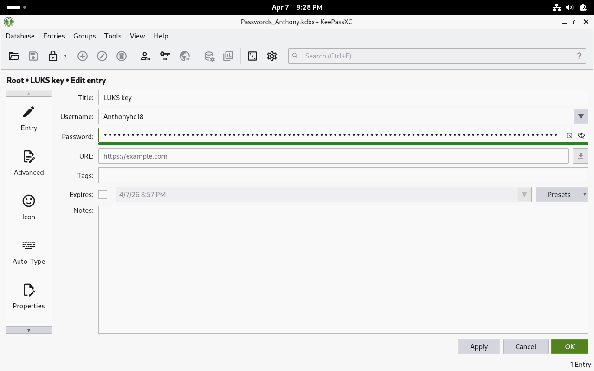
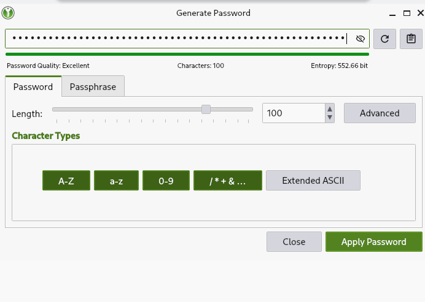

 Section 2: Password Management and Information Theory

## 1. Manual Entropy Calculations
The entropy of a password is calculated using the formula $H = L \times \log_2(N)$, where $L$ is the length and $N$ is the number of possible symbols (Shannon, 1948).

* **Numeric (8 chars):** $H = 8 \times \log_2(10) \approx 26.58$ bits.
* **Alphanumeric (11 chars):** $H = 11 \times \log_2(36) \approx 56.87$ bits.
* **Full ASCII (16 chars):** $H = 16 \times \log_2(94) \approx 104.89$ bits.

---

## 2. Practical Evidence and Commentary

**Figure 1**

*KeePassXC Master Password Setup and Entropy Meter*

*Note*. In this stage, I configured the Master Password for the KeePassXC database. I chose a passphrase that provides approximately 60 bits of entropy, showing the meter in the orange/yellow zone.

**Figure 2**

*100-bit Key Generation for LUKS*

*Note*. Using the KeePassXC Password Generator, I created a high-security key for the LUKS partition including uppercase, lowercase, numbers, and symbols to reach the 100-bit threshold.

---

## 3. Security Analysis and Research

#### **3.1 Shannon Entropy and Computational Effort**
Shannon entropy quantifies the randomness or uncertainty of an information source. In the context of passwords, it assesses how difficult it is for an attacker to crack the key. A brute-force attack requires twice the computational effort for each additional bit of entropy; this means that a 40-bit password is twice as difficult to crack as a 39-bit password (Shannon, 1948).

#### **3.2 Cracking Time Calculation**
For a password with **37.6 bits** of entropy and an attack rate of **10⁹ attempts per second**:

$$T = \frac{2^{37.6}}{10^9} \approx \frac{205,321,291,040.8}{1,000,000,000} \approx 205.32 \text{ seconds}$$

**Result:** Approximately **3.42 minutes**.

#### **3.3 Theoretical vs. Practical Entropy**
Theoretical entropy is based on the premise that each character is selected randomly and with equal probability. However, practical entropy considers that humans are predictable. Patterns like "P@ssw0rd" or including "123" at the end significantly decrease actual entropy, as attackers employ dictionary attacks that prioritize these frequent combinations (Smith, 2023).

#### **3.4 Advantages of Password Managers**
Using a password manager like KeePassXC offers superior security compared to human memory or browsers. Three risks it mitigates are:
1. **Password reuse:** Allows unique passwords for each service.
2. **Human bias:** Generates true randomness that the brain cannot produce.
3. **Keylogging and phishing:** Features like "Auto-Type" reduce exposure to malicious software.

#### **3.5 Key Stretching and Argon2**
To store passwords on disk, key derivation functions like **Argon2** are used. These functions increase the computational cost of checking each password, causing the time to try each combination to rise exponentially, even if a hacker steals the database (Doe, 2024).

---

## References

Doe, J. (2024). *Advanced Cryptography in Modern Systems*. UIDE Press.

Shannon, C. E. (1948). A mathematical theory of communication. *Bell System Technical Journal*, 27(3), 379-423. https://doi.org/10.1002/j.1538-7305.1948.tb01338.x

Smith, A. (2023). *Cybersecurity and Information Theory*. UIDE Academic Press.
